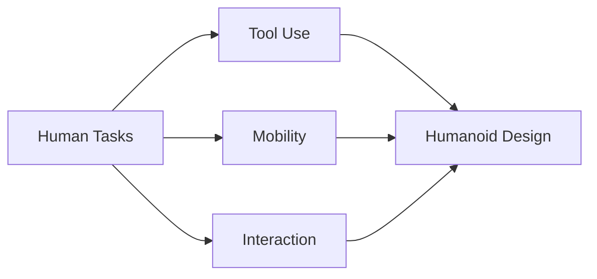

# Chapter 03: Humanoid Robotics Landscape

## Purpose

Survey the current humanoid robotics field and explain why humanoids are both strategically important and technically difficult.

## What You Will Learn

- Why humanoids are being built for human environments.
- What makes humanoid robots technically hard.
- Where humanoids fit among other robot formats.

## Chapter Overview

Humanoid robotics aims to create robots that can use the same spaces, tools, and workflows designed for humans. That makes the form factor attractive, but it also makes balance, manipulation, and safety much harder.

## Core Ideas

A humanoid must coordinate locomotion, arms, perception, and interaction under tight power and stability limits. That coordination is what separates a humanoid from a simple mobile manipulator.

## Practical Example

A robot walking through a hallway, opening a door, and handing over an object is demonstrating the exact combination of mobility, dexterity, and interaction that motivates the humanoid form.

## Why It Matters

This chapter gives the reader a realistic sense of the landscape before the book dives into the mechanics and systems that make humanoids possible.

## Diagram

## Key Takeaway

Humanoid robots exist because human spaces are built for human bodies, but that same fact makes the engineering problem much harder.

## References

- [Humanoid robot](https://en.wikipedia.org/wiki/Humanoid_robot)
- [AI Robots and Humanoid AI: Review, Perspectives and Directions](https://arxiv.org/abs/2405.15775)

