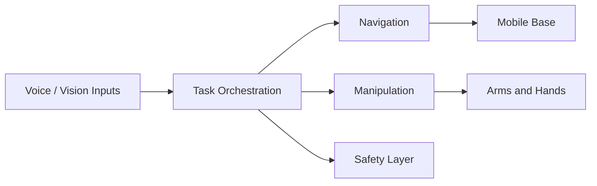

# Chapter 04: Ros2 Architecture

## Purpose

Present the full capstone system architecture and show how all previous chapters connect.

## What You Will Learn

- How the final system is divided into modules.
- How data and control flow through the stack.
- How the book turns into one integrated robot.

## Chapter Overview

This chapter is the structural summary of the book. It shows how sensing, speech, language, navigation, manipulation, and hardware fit together into one coherent humanoid system.

## Core Ideas

The architecture should separate perception, language understanding, planning, control, and safety while keeping the interfaces explicit.

## Practical Example

A spoken command can be routed through voice recognition, task planning, navigation, and manipulation without collapsing into one monolithic program.

## Why It Matters

The capstone architecture proves that the earlier chapters were building toward a real integrated system, not isolated topics.

## Diagram

## Key Takeaway

A good robot architecture makes complex behavior understandable and maintainable.

## References

- [Isaac ROS](https://nvidia-isaac-ros.github.io/)

