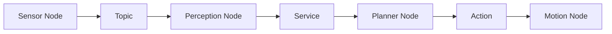

# Chapter 05: Nodes Topics Services

## Purpose

Explain the core ROS 2 communication patterns in a way the reader can use immediately.

## What You Will Learn

- How nodes isolate robot behaviors.
- How topics move streaming data.
- How services and actions differ from topics.

## Chapter Overview

This chapter turns ROS 2 theory into working communication patterns. Once the reader understands these primitives, they can design sensor pipelines and command flows clearly.

## Core Ideas

Topics are best for continuous data, services for request-response calls, and actions for longer-running tasks with progress reporting.

## Practical Example

A robot may publish LiDAR scans on a topic, ask a localization service for a map query, and run a navigation action to a goal with feedback.

## Why It Matters

Good communication design is what prevents robot software from collapsing under complexity. It also makes debugging and integration much easier.

## Diagram

## Key Takeaway

ROS 2 communication primitives are the language of robot integration.

## References

- [Robot Operating System](https://en.wikipedia.org/wiki/Robot_Operating_System)
- [ROS 2 docs](https://docs.ros.org/)

