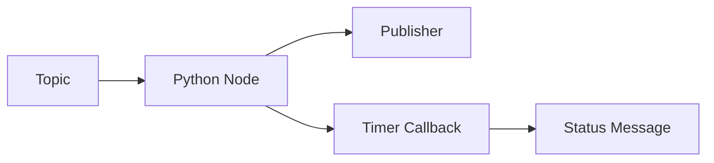

# Chapter 06: Rclpy Python

## Purpose

Show how to build ROS 2 logic in Python using rclpy.

## What You Will Learn

- How to create a ROS 2 node in Python.
- How to publish and subscribe to messages.
- How timers and callbacks drive robot behavior.

## Chapter Overview

rclpy is the Python client library for ROS 2. It is the easiest way to prototype robot logic because it makes node creation, message passing, and callback handling straightforward.

## Core Ideas

The main concepts are node lifecycle, publishers, subscribers, timers, parameters, and spinning the executor to process callbacks.

## Practical Example

A monitoring node can subscribe to a camera feed, compute a simple metric every second, and publish status updates to the rest of the system.

## Why It Matters

This chapter gives the reader a practical coding entry point before they move into more advanced robotics stacks.

## Diagram

## Key Takeaway

rclpy lets Python developers participate directly in ROS 2 robotics systems.

## References

- [ROS 2 docs](https://docs.ros.org/)
- [Robot Operating System](https://en.wikipedia.org/wiki/Robot_Operating_System)

