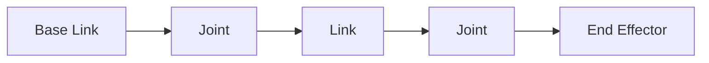

# Chapter 07: Urdf

## Purpose

Explain how URDF describes a robot's physical structure and motion relationships.

## What You Will Learn

- How links and joints represent the robot body.
- Why kinematic structure matters.
- How URDF supports visualization and simulation.

## Chapter Overview

URDF is the canonical robot description format in the ROS ecosystem. It defines the robot's parts and how they connect, which is essential for visualization, planning, and simulation.

## Core Ideas

A good URDF captures geometry, joint limits, coordinate frames, and the hierarchy of the body. Once this model is correct, many downstream tools become usable.

## Practical Example

A simple arm with a base link, shoulder joint, elbow joint, and wrist can be represented cleanly in URDF and then reused in simulation and motion planning.

## Why It Matters

Robot software needs a shared structural model. URDF provides that shared source of truth.

## Diagram

## Key Takeaway

URDF turns a robot from an idea into a machine description that software can use.

## References

- [URDF](https://en.wikipedia.org/wiki/URDF)
- [ROS 2 docs](https://docs.ros.org/)

