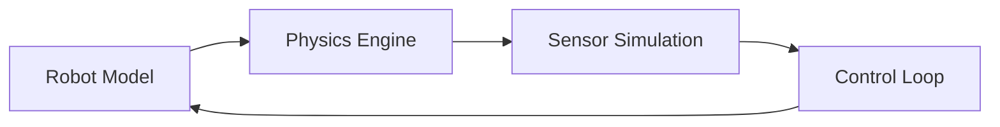

# Chapter 08: Gazebo

## Purpose

Use Gazebo to explain how robot behavior can be tested in simulation before hardware is involved.

## What You Will Learn

- How worlds, models, and physics interact.
- Why simulation reduces risk.
- How sensor and actuator behavior can be exercised virtually.

## Chapter Overview

Gazebo provides a physics-aware environment for robot testing. It is valuable because it lets developers explore movement, perception, and control without risking broken hardware.

## Core Ideas

The simulator combines models, physics engines, sensors, and plugins. This makes it possible to test state changes, collisions, and control loops in a controlled way.

## Practical Example

A robot can be placed in a simulated room, asked to move toward a target, and evaluated on whether its path planning, sensing, and control behave correctly.

## Why It Matters

Simulation is the bridge between abstract algorithms and real deployment. Gazebo is one of the most important tools in that bridge.

## Diagram

## Key Takeaway

Gazebo makes robot development safer, faster, and easier to debug.

## References

- [Gazebo simulator](https://en.wikipedia.org/wiki/Gazebo_%28simulator%29)
- [Gazebo docs](https://gazebosim.org/docs/)

