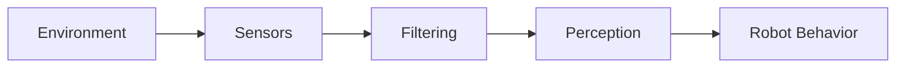

# Chapter 10: Sensors

## Purpose

Explain how sensors turn the physical world into usable robot data.

## What You Will Learn

- Common robot sensor types.
- Why calibration and noise matter.
- How sensors feed perception and control.

## Chapter Overview

Sensors are the robot's contact with reality. They provide the raw signals that make perception, localization, navigation, and manipulation possible.

## Core Ideas

Different sensors solve different problems: cameras for appearance, depth sensors for structure, IMUs for motion, and tactile sensors for contact.

## Practical Example

A depth camera can help a robot detect a table edge, while an IMU helps stabilize its motion and understand orientation.

## Why It Matters

Without reliable sensor handling, even a good AI model will make bad decisions because its inputs do not reflect reality accurately.

## Diagram

## Key Takeaway

Sensors are not just input devices; they are the foundation of trustworthy robot behavior.

## References

- [Isaac Sim Documentation](https://docs.isaacsim.omniverse.nvidia.com/latest/index.html)
- [RealSense](https://en.wikipedia.org/wiki/RealSense)

