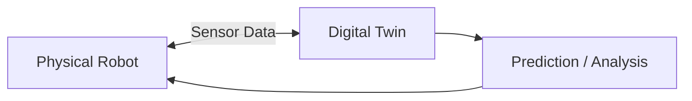

# Chapter 11: Digital Twins

## Purpose

Explain how digital twins mirror physical systems and support testing, monitoring, and maintenance.

## What You Will Learn

- What makes a digital twin different from a static model.
- How live data keeps the twin aligned with reality.
- Why digital twins matter for robotics iteration.

## Chapter Overview

A digital twin is a living virtual counterpart of a physical system. In robotics, it helps developers test behavior, detect divergence, and understand how the system is changing over time.

## Core Ideas

The twin consists of the physical robot, the digital representation, and the data connection between them. The live link is what makes it a twin instead of just a simulation.

## Practical Example

A robot arm in production can be mirrored in a digital twin to compare expected trajectories with actual sensor data and catch drift early.

## Why It Matters

Digital twins make robotics more measurable. They also create a better path from simulation to deployment.

## Diagram

## Key Takeaway

A digital twin is valuable because it stays synchronized with the real machine and helps interpret what is happening.

## References

- [Digital twin](https://en.wikipedia.org/wiki/Digital_twin)

