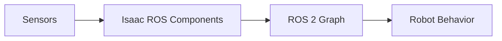

# Chapter 13: Isaac Ros

## Purpose

Explain how Isaac ROS connects NVIDIA acceleration with the ROS 2 ecosystem.

## What You Will Learn

- How Isaac ROS accelerates perception and robotics pipelines.
- Why ROS compatibility matters.
- How common utilities and packages reduce integration effort.

## Chapter Overview

Isaac ROS brings accelerated robot components into the ROS 2 world. That is valuable because it lets developers keep the familiar ROS structure while using NVIDIA-focused performance optimizations.

## Core Ideas

The important idea is not just speed. It is the ability to keep the system modular while improving throughput and latency.

## Practical Example

A perception pipeline can use camera input, GPU-accelerated processing, and ROS 2 messaging without rewriting the whole robot stack.

## Why It Matters

For robots that need edge performance, the combination of ROS 2 structure and GPU acceleration is a practical advantage.

## Diagram

## Key Takeaway

Isaac ROS helps robotics teams accelerate computation without abandoning ROS workflows.

## References

- [Isaac ROS](https://nvidia-isaac-ros.github.io/)
- [Isaac ROS Common](https://github.com/NVIDIA-ISAAC-ROS/isaac_ros_common)

