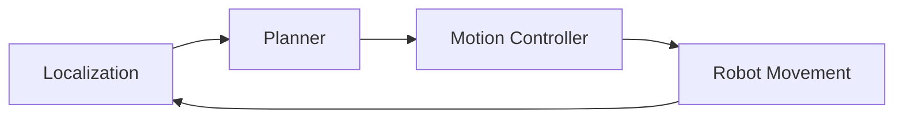

# Chapter 15: Navigation

## Purpose

Explain how robots plan paths, avoid obstacles, and move toward goals.

## What You Will Learn

- How localization, mapping, and planning fit together.
- Why navigation is more than route finding.
- How obstacle avoidance and goal tracking work.

## Chapter Overview

Navigation is the machinery that turns perception into movement. It combines maps, localization, path planning, and motion control into one autonomy loop.

## Core Ideas

A robot must know where it is, where it wants to go, what obstacles exist, and how to move safely through the environment.

## Practical Example

A service robot can receive a destination, compute a path, replan if the corridor changes, and stop safely if a person walks into its route.

## Why It Matters

Navigation is one of the clearest demonstrations that physical AI is not a text-only problem. The world pushes back.

## Diagram

## Key Takeaway

Navigation is the practical bridge between sensing the world and moving through it safely.

## References

- [Robot navigation](https://en.wikipedia.org/wiki/Robot_navigation)

