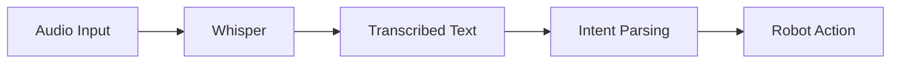

# Chapter 16: Whisper

## Purpose

Explain how Whisper turns speech into text for robot interaction.

## What You Will Learn

- Why speech recognition matters in robotics.
- How Whisper supports voice interfaces.
- Why transcription errors must be handled carefully.

## Chapter Overview

Whisper provides a speech-to-text front end that can feed commands into a robot system. That makes it a useful component for voice control and conversational interaction.

## Core Ideas

The model is strong at multilingual transcription, but like all speech systems it can still mishear noise, accents, or ambiguous input.

## Practical Example

A user says a command aloud, Whisper produces text, and the robot interprets that text as a task request.

## Why It Matters

Voice is one of the most natural ways to interact with a robot, but it only works well when the system handles recognition and uncertainty correctly.

## Diagram

## Key Takeaway

Whisper is the speech layer that lets a robot hear the human operator.

## References

- [OpenAI Whisper](https://github.com/openai/whisper)

