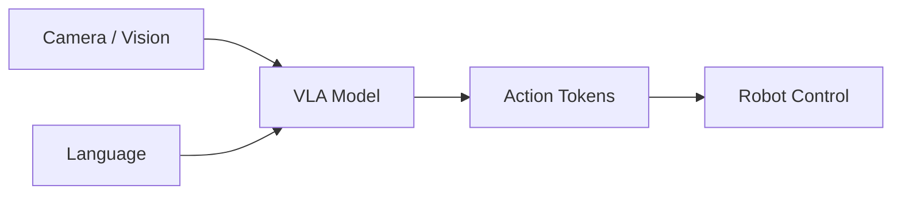

# Chapter 18: Vision Language Action

## Purpose

Explain how vision, language, and action can be fused into a single robotic policy.

## What You Will Learn

- What VLA systems are.
- How perception and language ground action.
- Why dataset quality matters.

## Chapter Overview

Vision-language-action systems take a visual observation and a language instruction and directly map them to robot actions. This makes them one of the most important recent directions in embodied AI.

## Core Ideas

The challenge is grounding: the model must understand what is in the image, what the instruction means, and what action is physically feasible.

## Practical Example

If the robot sees a cup and hears "move the cup to the tray," the VLA layer should convert that instruction into a concrete manipulation plan.

## Why It Matters

VLA is the bridge between modern multimodal AI and robot control.

## Diagram

## Key Takeaway

VLA systems unify seeing, understanding, and acting in one model family.

## References

- [Vision-language-action model](https://en.wikipedia.org/wiki/Vision-language-action_model)
- [VLA survey](https://arxiv.org/abs/2507.10672)

