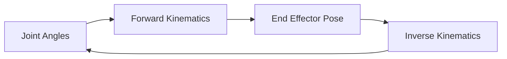

# Chapter 20: Kinematics

## Purpose

Explain the geometric foundations of robot motion.

## What You Will Learn

- How forward and inverse kinematics differ.
- Why joint relationships matter.
- How body geometry shapes reachable motion.

## Chapter Overview

Kinematics describes motion without focusing on force. For humanoids, it is the language used to reason about where limbs can move and how postures are represented.

## Core Ideas

The main idea is to map joint values to poses and, when needed, solve the reverse problem of finding joints that achieve a target pose.

## Practical Example

If a robot hand must reach a shelf, kinematics tells us whether the pose is reachable and what joint configuration is required.

## Why It Matters

Without kinematics, motion planning and manipulation are guesses rather than engineered solutions.

## Diagram

## Key Takeaway

Kinematics turns robot motion into a solvable geometric problem.

## References

- [Kinematics](https://en.wikipedia.org/wiki/Kinematics)
- [Robot kinematics](https://en.wikipedia.org/wiki/Robot_kinematics)

