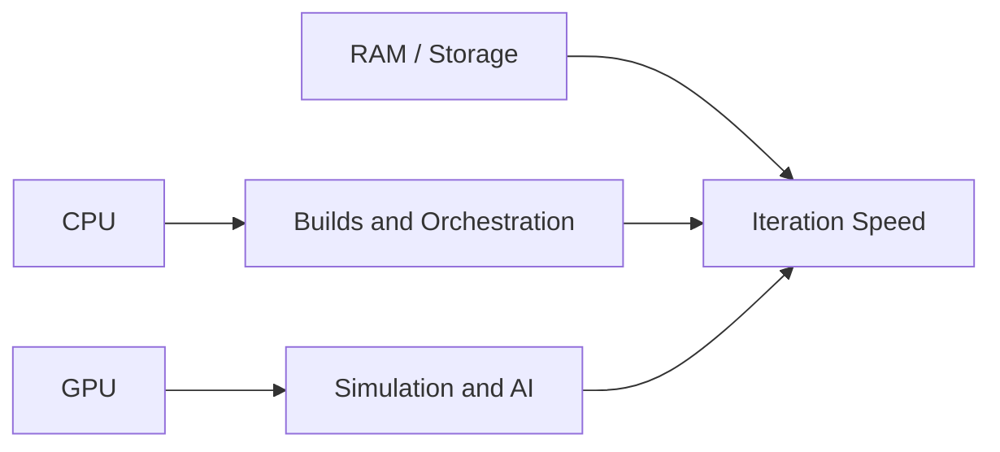

# Chapter 24: Workstations

## Purpose

Explain the development machine needed for robotics, simulation, and AI work.

## What You Will Learn

- Why robotics workstations need strong CPU and GPU resources.
- How memory, storage, and thermals affect productivity.
- Why local development matters for simulation-heavy projects.

## Chapter Overview

A robotics workstation is the main development environment for simulation,
debugging, training, and integration. It is where developers run large models,
test robot behavior, inspect logs, and work on the physical AI stack before it
moves onto edge hardware.

The workstation matters because robotics is compute-heavy. Simulation can be
slow, perception pipelines can be expensive, and model testing can consume a
lot of memory and storage. If the machine is underpowered, the developer spends
more time waiting than building.

## Core Ideas

- **CPU** supports orchestration, builds, and general processing.
- **GPU** accelerates perception, simulation, and model inference.
- **RAM** keeps large scenes and datasets usable.
- **Storage** must be fast enough for logs, models, and assets.

A good workstation is not just a fast laptop. It is a stable base for the
entire development cycle, especially when the project uses simulation and AI
components together.

## Practical Example

A robotics developer may run a simulator, a ROS 2 graph, a vision model, and a
logging dashboard at the same time. That workload is very different from common
office software, and it explains why workstation planning is a real design
decision in robotics.

## Diagram

## Key Takeaway

A strong workstation is the foundation of efficient robotics development.

## Hands-On Project

Specify a workstation profile for the book.

## Diagrams

- Workstation architecture

## References

- Hardware guidance
