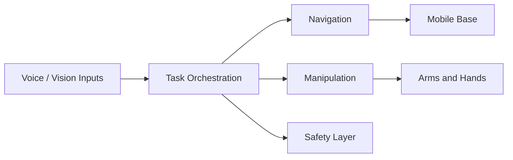

# Chapter 28: Architecture

## Purpose

Present the end-to-end architecture for the capstone humanoid system.

## What You Will Learn

- How the full stack is divided into modules.
- How data and control move through the system.
- Why clear boundaries make integration possible.

## Chapter Overview

This chapter is the structural summary of the book. It shows how the physical
AI stack becomes one robot system instead of a collection of unrelated tools.
The capstone architecture connects sensing, language, planning, navigation,
manipulation, and safety.

The key design principle is modularity. Each part should have a clear job and a
clear interface. That makes the system easier to debug, test, and extend.

## Core Ideas

- **Input layer** handles speech and vision.
- **Task layer** interprets intent and selects goals.
- **Execution layer** handles navigation and manipulation.
- **Safety layer** limits harmful or unstable behavior.

An architecture chapter is where the reader sees how all previous topics fit
together in a realistic robot stack.

## Practical Example

A spoken request may trigger object recognition, route planning, motion, and a
final handoff action. If the robot cannot keep those parts separated, the
system becomes difficult to maintain.

## Diagram

## Key Takeaway

A good robot architecture makes complex behavior understandable and manageable.

## Hands-On Project

Draw the capstone architecture as a block diagram.

## Diagrams

- Full system architecture

## References

- Integration references
