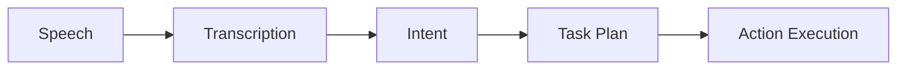

# Chapter 29: Voice to Action

## Purpose

Convert voice commands into robot actions.

## What You Will Learn

- How spoken instructions become structured tasks.
- Why clarification and confirmation matter.
- How execution feedback closes the loop.

## Chapter Overview

Voice to action is the pipeline that turns a human request into a physical
robot behavior. It combines speech recognition, intent parsing, task planning,
and action execution.

The important idea is grounding. The robot must understand what the words mean
in the current environment, not just transcribe them correctly. A command is
useful only if it can become a safe action.

## Core Ideas

- **Speech recognition** turns audio into text.
- **Intent parsing** identifies the goal.
- **Planning** turns the goal into steps.
- **Execution** carries out the steps and reports progress.

If the command is ambiguous, the robot should ask for clarification instead of
guessing. That is one of the most important design decisions in a human-facing
robot system.

## Practical Example

If the user says "go to the desk and stop," the system should identify the desk,
plan the route, move to the target, and confirm completion. If the route is
blocked, it should report the problem rather than silently failing.

## Diagram

## Key Takeaway

Voice becomes useful only when it can trigger grounded physical behavior.

## Hands-On Project

Create a simple voice-command flow with confirmation.

## Diagrams

- Voice-to-action sequence

## References

- Voice interface references
