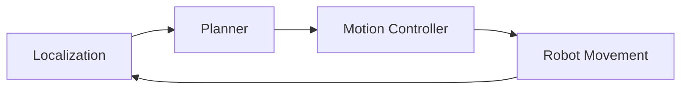

# Chapter 30: Navigation

## Purpose

Move the robot through the environment.

## What You Will Learn

- How localization and planning work together.
- Why obstacle handling changes the path in real time.
- How navigation supports the final humanoid system.

## Chapter Overview

Navigation is the part of robotics that decides how a robot moves from one
place to another. It combines map understanding, localization, route planning,
and motion control into one autonomy loop.

In a physical environment, the route is rarely static. A person can block the
hallway, an object can move, or the robot can lose confidence in its estimate
of position. Navigation therefore has to replan continually.

## Core Ideas

- **Localization** answers where the robot is.
- **Mapping** describes the world.
- **Planning** decides the route.
- **Control** executes the motion safely.

Navigation is more than moving toward a goal. It is the ability to keep making
good decisions as the world changes around the robot.

## Practical Example

A humanoid may need to walk from a charging station to a table. It has to
estimate its position, identify a safe path, avoid obstacles, and stop at the
right location even if the environment changes midway.

## Diagram

## Key Takeaway

Navigation turns physical AI from perception into purposeful movement.

## Hands-On Project

Design the navigation flow for a room-crossing task.

## Diagrams

- Navigation and recovery flow

## References

- Navigation references
