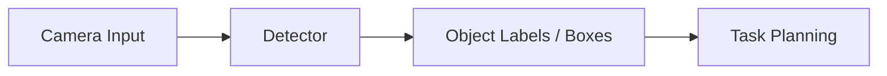

# Chapter 31: Object Detection

## Purpose

Detect useful objects in the environment.

## What You Will Learn

- How detection differs from classification.
- Why localization matters in robotics.
- How object detection supports action planning.

## Chapter Overview

Object detection identifies where semantic objects appear in an image or video.
For robotics, that matters because the robot must not only know what is present
but also where the target object is located.

Detection becomes a bridge between raw vision and robot behavior. Once the
system can detect a cup, a bottle, a chair, or a tool, it can plan navigation,
grasping, inspection, or dialogue around those objects.

## Core Ideas

- **Labels** identify object categories.
- **Bounding boxes** approximate location.
- **Confidence** helps the system know what it believes.
- **Tracking** keeps the object stable across frames.

The output is only useful if it is tied to action. A detected object should feed
into the rest of the robot pipeline, not remain a passive annotation.

## Practical Example

A robot in a room can detect a bottle on a table, estimate its position, and
pass that information to the grasp planner. If the bottle moves, the detector or
tracker updates the robot's understanding.

## Diagram

## Key Takeaway

Object detection turns vision into actionable scene understanding.

## Hands-On Project

Map a detection result to a robot response.

## Diagrams

- Perception-to-action flow

## References

- Detection references
