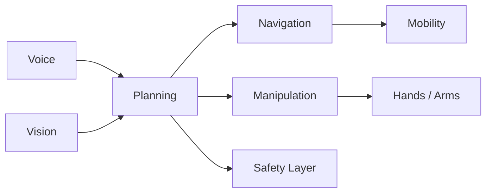

# Chapter 32: Autonomous Humanoid

## Purpose

Close the book with a staged autonomous humanoid demonstration.

## What You Will Learn

- How the full stack integrates into one robot.
- Why degraded modes and fallback behavior matter.
- How to think about the system as a complete product.

## Chapter Overview

The autonomous humanoid is the final synthesis of the book. It combines voice,
vision, localization, planning, manipulation, locomotion, and safety into one
system that can act in the physical world.

This chapter should feel like the payoff for everything that came before it. A
robot that can hear a request, understand the scene, move to the right place,
grasp an object, and report completion is no longer a loose collection of
modules. It is a coherent physical AI system.

## Core Ideas

- **Perception** tells the robot what is happening.
- **Reasoning** decides what to do.
- **Navigation** moves the robot through the environment.
- **Manipulation** lets the robot handle objects.
- **Safety** keeps the system usable around people.

The important engineering lesson is that no single module is enough. The robot
only becomes autonomous when all of the pieces work together under real-world
constraints.

## Practical Example

A spoken request can start a complete cycle: the robot hears the command,
identifies the target object, moves to the target, grasps it, carries it, and
returns a status update. If any step fails, the system should explain the
failure and fall back safely.

## Diagram

## Key Takeaway

An autonomous humanoid is not one model or one robot part. It is the full
physical AI stack working together.

## Hands-On Project

Write the demo plan for the final integrated robot.

## Diagrams

- Full autonomous humanoid architecture

## References

- Capstone checklists
